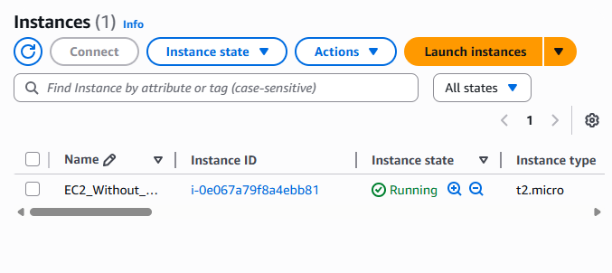

# 🚀 Terraform IaaS Deployment Guide — React Website

A beautifully designed **React-based web application** that provides an interactive step-by-step guide to deploying an **AWS EC2 instance using Terraform (Infrastructure as a Service - IaaS)**.

This project is perfect for beginners and intermediate learners who want to visually understand how **Infrastructure as Code (IaC)** works on **AWS using Terraform**.

---

## 🌟 Features

- 📄 **Detailed Terraform Steps**: Each step clearly explains Terraform concepts with easy-to-copy code snippets.
- 📌 **Visual Progress Tracker**: Track your learning journey through a step progress bar.
- 🖼 **Screenshot Uploads**: Upload and display your own Terraform command outputs, AWS Console, and SSH screenshots.
- 🛠 **Command Reference Section**: Quick access to essential, management, and advanced Terraform commands.
- 🔐 **Guided AWS IAM & Key Pair Setup**: Learn how to create Access Keys, IAM Users, and Key Pairs for AWS EC2 deployment.

---

## 📷 Demo Preview



---

## 📁 Project Structure

src/
├── assets/ # Images & static assets
├── components/ Terraform.jsx
└── App.jsx


---

## 🚀 Getting Started

### Prerequisites
- Node.js & npm

### Installation

```bash
git clone https://github.com/Sharmaujjawal123/Terraform-content.git)
cd Terraform-content
npm install
npm run dev
